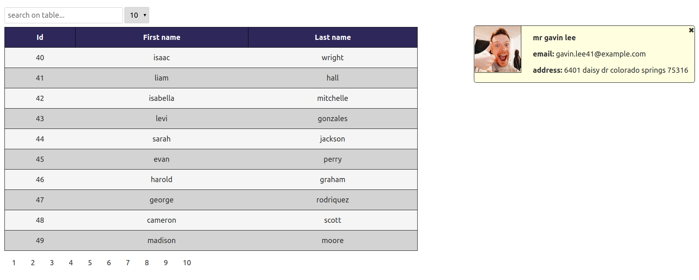

# test-takers component

This is a project template for [Svelte](https://svelte.dev) apps. It lives at https://github.com/sveltejs/template.

## Get started

Install the dependencies...

```bash
cd svelte-app
npm install
```

...then start [Rollup](https://rollupjs.org):

```bash
npm run dev
```

Navigate to [localhost:5000](http://localhost:5000). You should see the app running.


